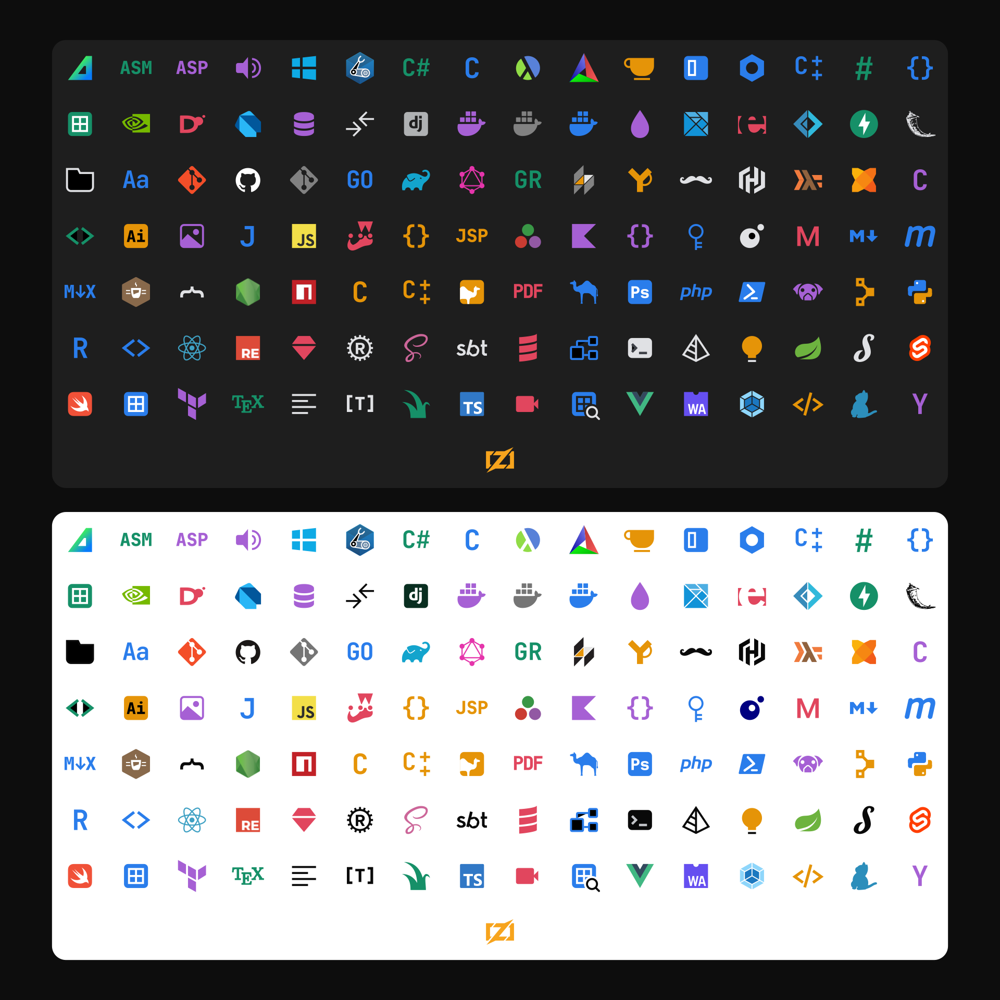

# Air File Icons

Air-inspired file icon themes for Visual Studio Code and Cursor. Ships with the minimal **Air File Icons** theme, the expansive **Air Material Icons** theme, and the **Air + Material Icons** hybrid that prefers Air icons and fills the gaps with Material.



> **Pairs with [Air](https://github.com/franzgollhammer/air-theme-vscode)** — companion color theme (dark + light) ported from JetBrains Air. Designed to look right next to these icons.


## Features

- **Air File Icons** — 112 monochrome-accent file icons, tuned for compact tree UIs
- **Air Material Icons** — 1245 colorful icons covering 1368 file extensions, 2124 filenames, and 4648 named folders
- **Air + Material Icons** — hybrid set: Air icons take priority, Material icons fill every gap (plus Material's named folders)
- Dark + light variants for all themes

## Install

### VS Code

1. Extensions panel (`Cmd+Shift+X` / `Ctrl+Shift+X`)
2. Search `Air File Icons`
3. Install
4. `Cmd+Shift+P` / `Ctrl+Shift+P` → `Preferences: File Icon Theme` → pick `Air File Icons`, `Air Material Icons`, or `Air + Material Icons`

### Cursor

Cursor pulls extensions from Open VSX. Same flow: open the Extensions panel, search `Air File Icons`, install, then pick it under `File Icon Theme`.

### Manual (`.vsix`)

Download the latest `.vsix` from [Releases](https://github.com/franzgollhammer/air-icons-vscode/releases), then:

```sh
code --install-extension air-file-icons-<version>.vsix
# or
cursor --install-extension air-file-icons-<version>.vsix
```

## Supported file types

Languages: JavaScript, TypeScript, React, Vue, Svelte, Python, Rust, Go, Java, Kotlin, Swift, C/C++, C#, Ruby, PHP, Dart, Elixir, Haskell, Scala, Clojure, Erlang, Lua, R, Julia, Zig, Nim, OCaml, F#, Groovy, Perl, and more.

Configs: Docker, Git, Webpack, Vite, Rollup, ESLint, Prettier, Babel, TSConfig, npm, pnpm, yarn, bun, Cargo, Maven, Gradle, Bazel, Terraform, Bicep, CMake, and more.

## Development

```sh
npm run dev           # launch VS Code with the extension loaded
npm run dev:insiders  # VS Code Insiders
npm run sync:zed      # sync Air Material Icons from ../air-icons-zed
npm run build:combined # regenerate the Air + Material hybrid theme
npm run package       # build .vsix
npm run install:local # package + install into VS Code
```

See [`scripts/`](scripts) for release automation.

## Attribution

- **Air File Icons** — derived from [JetBrains intellij-community](https://github.com/JetBrains/intellij-community), licensed under Apache 2.0
- **Air Material Icons** — full set from [Material Icon Theme](https://github.com/material-extensions/vscode-material-icon-theme), licensed under MIT

See [NOTICE](NOTICE) and [`icons/air-material/LICENSE.md`](icons/air-material/LICENSE.md).

## License

[Apache 2.0](LICENSE)
